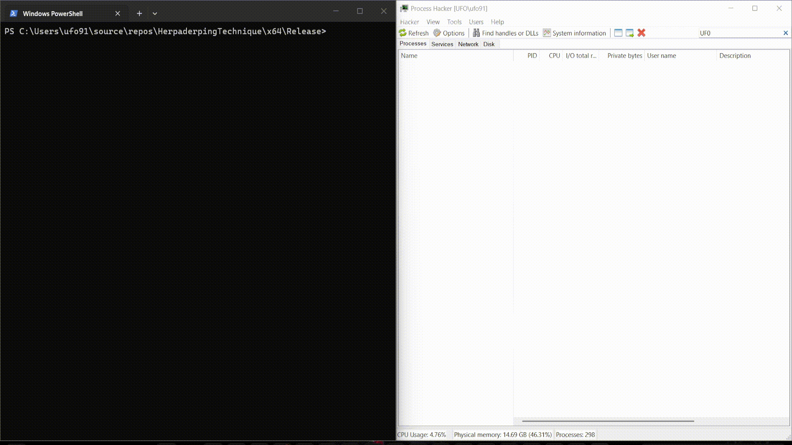
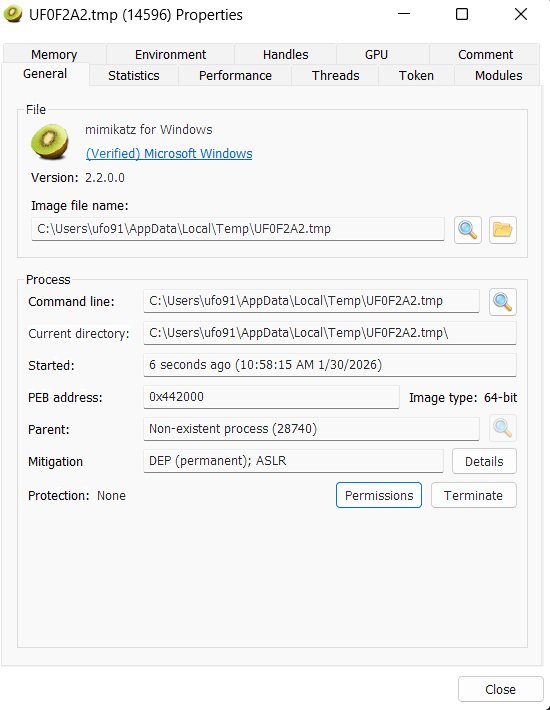

<h1 align="center">🎭 ProcHerp</h1>

<b>Low-Level Process Herpaderping & NTAPI Research Framework</b> 
Windows Internals · Native NTAPI · Disk–Memory Discrepancy Abuse

<h2>📌 Executive Summary</h2>

<b>ProcHerp</b> is a low-level Windows internals research project demonstrating the
<b>Process Herpaderping</b> technique — a stealthy process creation method that abuses
the discrepancy between a file’s on-disk representation and its executable image
mapped into memory.

The project relies exclusively on <b>native NTAPI calls</b>, bypassing high-level Win32
abstractions and showcasing how legitimate Windows kernel behavior can be leveraged
to achieve deceptive execution semantics.

<h2>🎭 Core Technique: Process Herpaderping</h2>

<ul>
<li><b>Stage 1 – The Bait:</b> 
A temporary file is created and populated with a controlled payload.</li>

<li><b>Stage 2 – The Mapping:</b> 
An executable image section is created using <code>NtCreateSection</code> with
<code>SEC_IMAGE</code>, causing the kernel to snapshot the payload into memory.</li>

<li><b>Stage 3 – The Creation:</b> 
A new process object is instantiated via <code>NtCreateProcessEx</code>, backed by the image section.</li>

<li><b>Stage 4 – The Switch:</b> 
The on-disk file is overwritten with a fully legitimate Windows binary
before execution begins.</li>

<li><b>Stage 5 – The Illusion:</b> 
Disk inspection shows a trusted executable, while the executing memory image
contains entirely different code.</li>
</ul>

<h2>🏗️ Software Architecture</h2>

<ul>
<li><b>Decoupled Design:</b> Hashing, NTAPI resolution, file operations, and process logic are isolated.</li>
<li><b>Extensible Layout:</b> Easily expandable into Process Ghosting or Doppelgänging.</li>
<li><b>Obfuscation-Friendly:</b> Non-standard symbols reduce static analysis signatures.</li>
</ul>

<h2>👻 Stealth & Anti-Analysis</h2>

<ul>
<li><b>Dynamic API Resolution (DJB2):</b> No suspicious static imports.</li>
<li><b>Direct NTAPI Calls:</b> Bypasses user-mode hooks in <code>kernel32.dll</code>.</li>
<li><b>PEB & Process Parameter Forging:</b> Legitimate-looking image path and command line.</li>
</ul>

<h2>🧠 Memory & Process Management</h2>

<ul>
<li>Manual construction of process parameters and environment blocks.</li>
<li>Memory manipulation via <code>NtAllocateVirtualMemory</code> and <code>NtWriteVirtualMemory</code>.</li>
<li>Execution initiated using <code>NtCreateThreadEx</code> at the real payload entry point.</li>
</ul>

<h2>▶️ Proof of Concept</h2>

<h3>1. Minimal Payload Demonstration</h3>

A controlled <b>MessageBox payload</b> executed from a herpaderped process while the
on-disk image remains fully <b>Microsoft-signed</b>.
This demonstration highlights the core disk–memory discrepancy with minimal noise.

 
<i>Figure 1: MessageBox payload executing from a herpaderped process.</i>

 
<i>Figure 2: Digital signature inspection showing a legitimate Microsoft-signed image.</i>

<h3>2. Advanced Payload Demonstration (Research)</h3>

A real-world offensive payload executed using the same Process Herpaderping flow.
This demonstration exists for research validation purposes only and is not required
to understand the core technique.

 
<i>Figure 3: Advanced payload executing while maintaining a trusted on-disk image.</i>

 
<i>Figure 4: Verified digital signature of the on-disk executable.</i>

<h2>🎯 Research Objectives</h2>

<ul>
<li>Study kernel behavior around <code>SEC_IMAGE</code> backed sections.</li>
<li>Observe detection gaps caused by disk–memory desynchronization.</li>
<li>Explore stealthy alternatives to traditional process hollowing.</li>
</ul>

<h2>⚠️ Legal & Ethical Disclaimer</h2>

This project is intended strictly for <b>educational and security research purposes</b>.
It is designed for malware analysts, reverse engineers, and Windows internals researchers.

The author does not condone misuse and is not responsible for any illegal or unethical
application of this code.

<b>Researcher:</b> BassamHossam (0xUFO)

